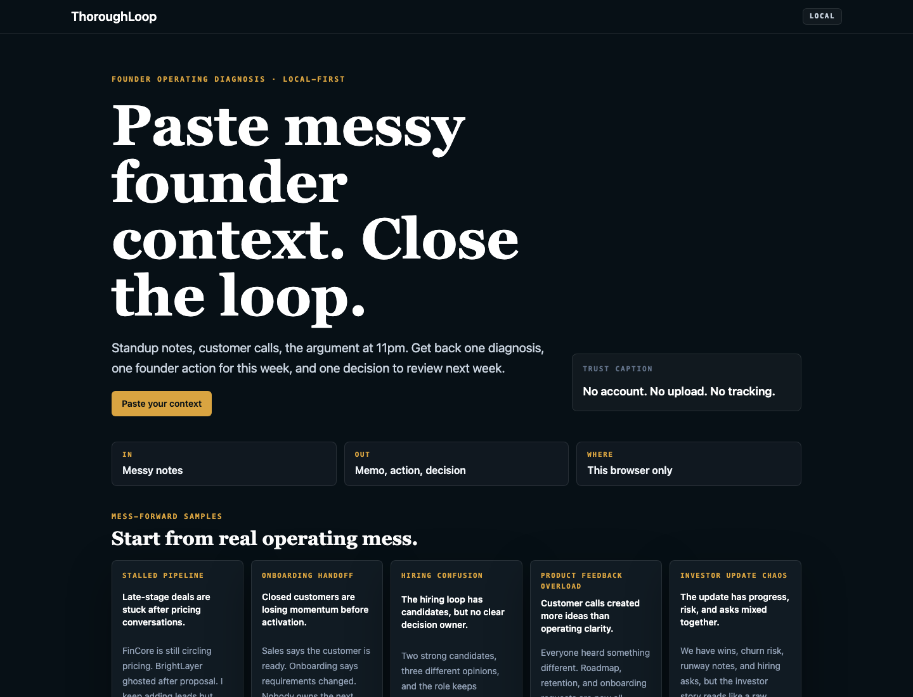
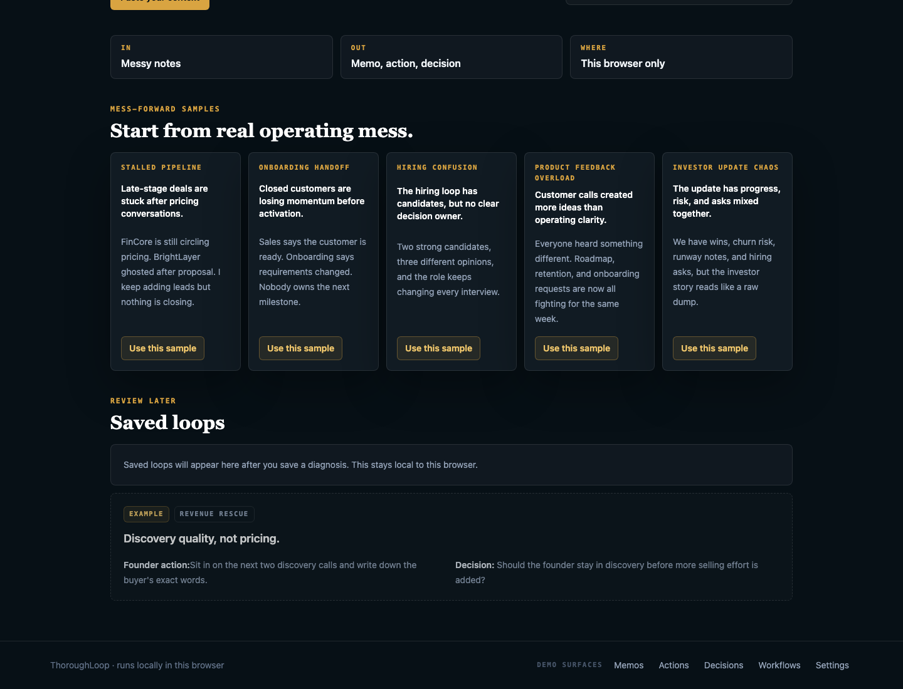
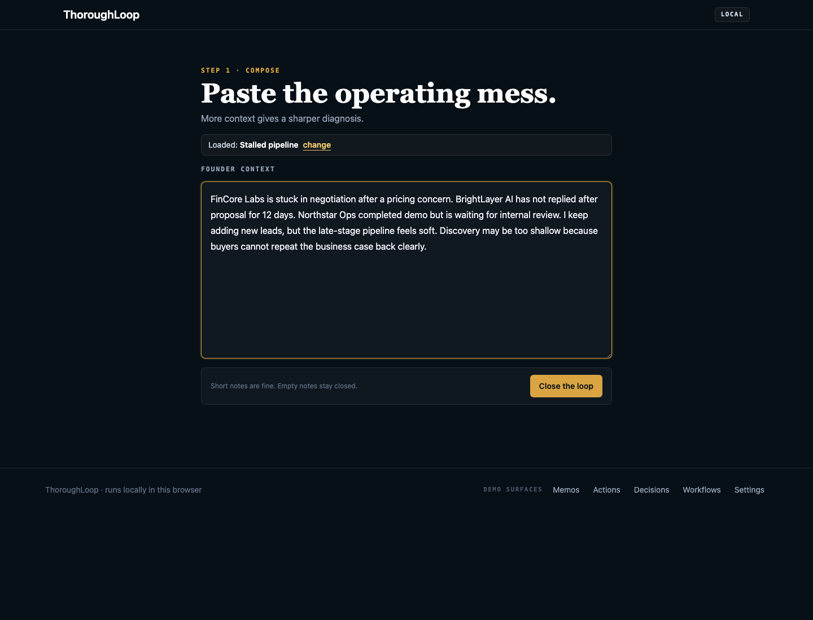
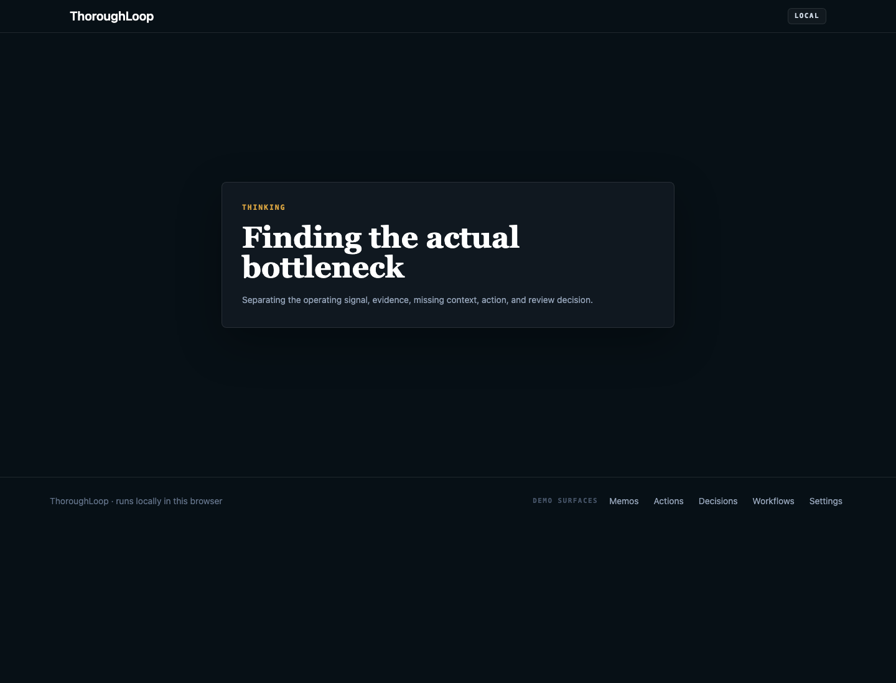
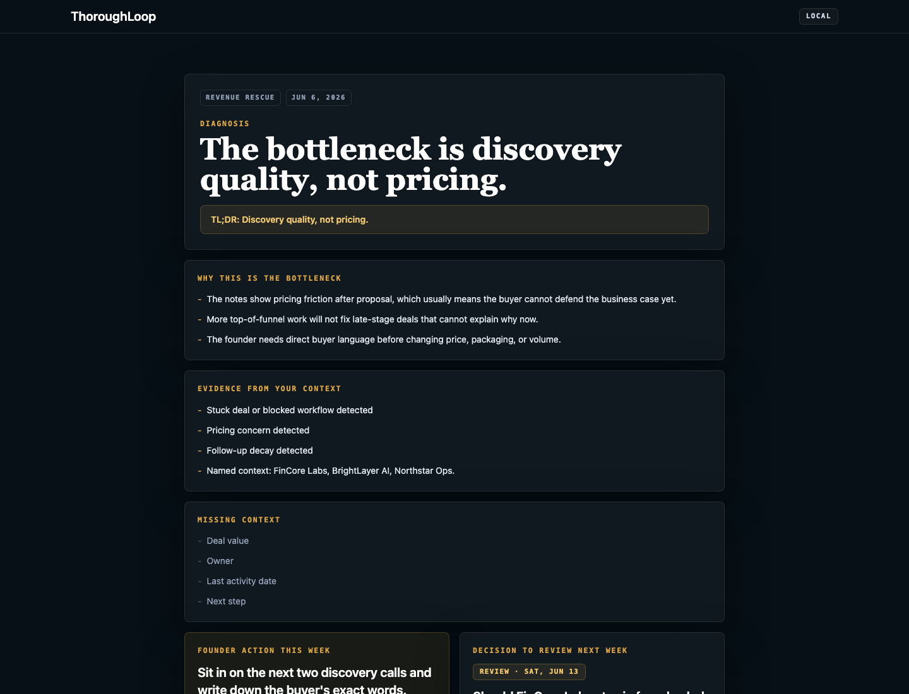
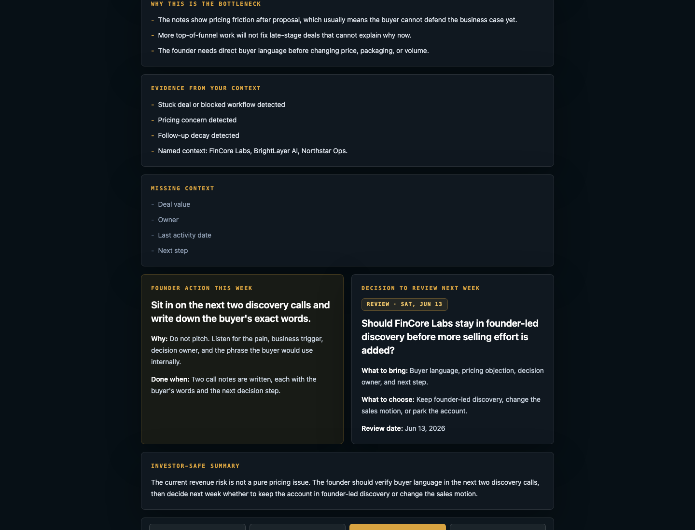
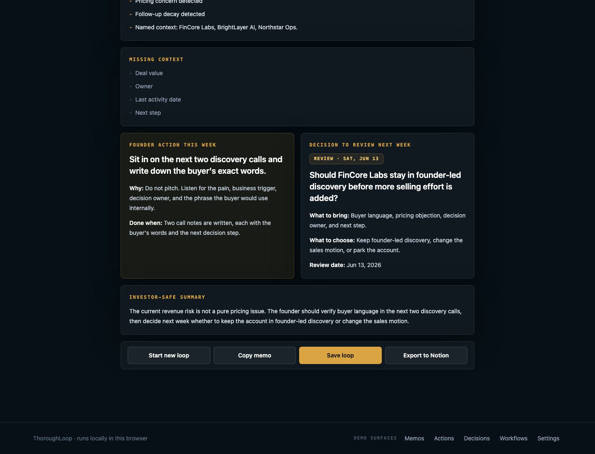
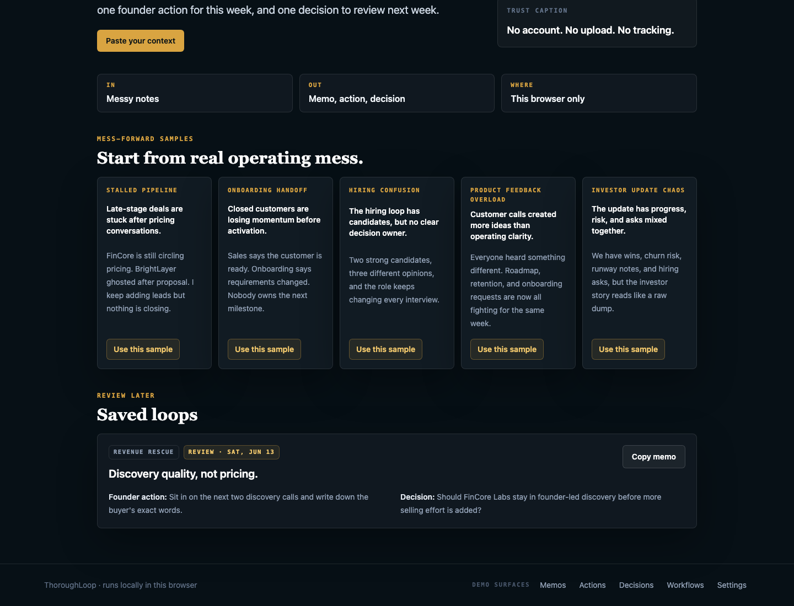

# ThoroughLoop

[](https://github.com/shubham1502-hue/thoroughloop/actions/workflows/ci.yml)

Paste messy founder context. Close the loop.

ThoroughLoop is a lightweight founder workflow tool that converts scattered operating context into a clear diagnosis, one next action, and one decision to review later.

Early-stage founders rarely suffer from a lack of tools. They suffer from scattered operating context across notes, calls, Slack messages, CRM updates, customer feedback, hiring follow-ups, and investor asks. ThoroughLoop helps turn that noise into a structured operating loop.

## Live Demo

https://thoroughloop.vercel.app

## Product Walkthrough

These screenshots use fictional sample founder context to show the current browser loop.

### 1. Start with messy founder context

Landing page introducing the founder workflow, local-first boundary, and main call to action.



### 2. Choose a founder operating mess

Sample cards show common founder situations such as stalled pipeline, onboarding handoff, hiring confusion, product feedback overload, and investor update chaos.



### 3. Paste or load the messy context

The app starts with raw founder context, not a form-heavy workflow.



### 4. Separate the operating signal

ThoroughLoop separates signal, evidence, missing context, action, and review decision.



### 5. Review the diagnosis

The result starts with one bottleneck diagnosis and a short TL;DR.



### 6. Inspect the memo evidence

The memo explains why this is the bottleneck, what evidence came from the context, and what context is still missing.



### 7. Turn the memo into action and decision

The app converts messy context into one founder action for this week and one decision to review next week.



### 8. Save the loop for review

Saved loops remain available locally in the browser so the founder can return to the action and decision later.



## Why This Exists

The problem is not storage. The problem is decision clarity.

Early-stage founders often have the context they need, but it is split across call notes, customer messages, sales updates, hiring feedback, investor drafts, and half-finished follow-ups. That makes it hard to see the actual operating issue, choose the next founder action, and revisit the decision later.

ThoroughLoop is designed to close the loop from messy context to action and review. It is not trying to become another PM system, CRM, dashboard, or Notion workspace.

## Who This Is For

- Early-stage founders with scattered sales, product, customer, hiring, or investor context.
- Founder's Office and BizOps operators supporting founder-led teams.
- Operators trying to convert messy updates into decisions and follow-ups.
- Teams before they have mature RevOps, BizOps, or operating cadence.

## Before And After

Before ThoroughLoop:

- Notes are scattered.
- Follow-ups are unclear.
- Decisions are made informally.
- Founder context gets lost.
- Review rarely happens.

After ThoroughLoop:

- The operating issue is diagnosed.
- The memo is structured.
- The next action is explicit.
- The decision is saved.
- The review loop is visible.

## How The Loop Works

1. Paste messy founder context.
2. ThoroughLoop identifies the operating pattern.
3. It generates a structured founder memo.
4. It extracts one founder-level action.
5. It saves one decision.
6. The decision can be reviewed later.

The current diagnosis and memo behavior is deterministic product logic in `packages/core`. It does not call an AI provider or external model.

## Example Founder Use Cases

### Sales Pipeline Confusion

Scenario: A founder has scattered notes from sales calls, CRM updates, and follow-ups.

Output: ThoroughLoop identifies the operating bottleneck, creates a short memo, suggests one founder action, and saves a decision to review later.

### Customer Feedback Overload

Scenario: A founder has scattered customer complaints, feature requests, and support notes.

Output: ThoroughLoop extracts the core pattern and turns it into one decision point instead of another messy backlog.

### Hiring Process Drift

Scenario: A founder has candidate notes, team feedback, and unclear role requirements.

Output: ThoroughLoop clarifies the bottleneck, next action, and decision owner.

### Investor Update Preparation

Scenario: A founder has raw updates, wins, blockers, metrics, and open questions.

Output: ThoroughLoop helps structure the operating narrative before it becomes an investor-facing update.

See [examples/](examples/) for realistic fictional sample inputs and outputs.

## Try The Demo

No login is required. Demo data is stored locally in the browser.

1. Open the [live demo](https://thoroughloop.vercel.app).
2. Paste messy founder context or choose a sample.
3. Generate an operating diagnosis.
4. Review the founder memo.
5. Save one action.
6. Save one decision.
7. Revisit the decision in the review loop.

For a slightly longer manual path, see [docs/demo-walkthrough.md](docs/demo-walkthrough.md).

## What The Demo Proves

- Messy founder context can be turned into a narrow operating diagnosis.
- A founder memo, founder action, and decision review can come from the same loop.
- Saved loops, memos, actions, decisions, and settings persist in browser storage for the current browser profile.
- The app can route the same core loop through web pages, workflow-specific pages, API intake examples, and webhook-shaped examples.
- The MVP can be reviewed publicly without claiming customers, traction, production persistence, or live provider sync.

## What Reviewers Can Inspect

- The main loop on `/`.
- Saved memos on `/memos`.
- Founder actions on `/action-queue`.
- Decisions to review on `/decision-log`.
- Workflow-specific loops on `/workflows`.
- Local founder context defaults on `/settings`.
- Public-safe intake and webhook examples in [docs/demo/api-and-webhook-demo.md](docs/demo/api-and-webhook-demo.md).
- Optional Notion export setup in [docs/notion-export.md](docs/notion-export.md), which requires explicit environment configuration and is not the app's persistence layer.

## Founder Validation Resources

These docs support early feedback conversations. They do not claim validation has happened.

- [Founder validation plan](docs/founder-validation-plan.md).
- [Validation log template](docs/validation-log-template.md).
- [Feedback analysis framework](docs/founder-feedback-analysis-framework.md).
- [Validation scorecard](docs/validation-scorecard.md).
- [Founder learning journal](docs/founder-learning-journal.md).
- [Demo script](docs/demo-script.md).
- [Outreach message bank](docs/founder-outreach-message-bank.md).

Supporting materials: [founder-facing audit](docs/founder-facing-audit.md) and [example founder loops](examples/).

## Validation Evidence Resources

- [Founder evidence repository](docs/founder-evidence-repository.md).
- [Founder signal tracker](docs/founder-signal-tracker.md).
- [Founder objection library](docs/founder-objection-library.md).
- [Founder language bank](docs/founder-language-bank.md).
- [Founder validation retrospective template](docs/founder-validation-retrospective-template.md).

## What This Project Demonstrates

This project is not just a software build. It is a founder-operator case study.

- Identifying ambiguous early-stage operating problems.
- Reducing messy founder context into structured workflows.
- Designing lightweight operating loops without overbuilding.
- Translating business pain into product behavior.
- Creating founder-facing artifacts such as memos, actions, and decision reviews.
- Shipping a public MVP with clear scope, documentation, and validation checks.

## Current Limitations

Current status: public MVP, early feedback stage.

- Local browser and device storage only.
- No user accounts.
- No production database.
- No team workspace.
- No payments.
- No production external integrations or live provider sync.
- Saved data may not persist across browsers, devices, private sessions, or cleared browser storage.
- No AI provider integration or server-side AI generation.
- Diagnosis and memo generation use deterministic workflow logic in `packages/core`.

ThoroughLoop does not currently include user accounts, a production database, or server-side persistence for saved loops. Some server-side Next.js routes exist for API intake, webhook normalization, and optional Notion export exploration, but the MVP stores user-created loops locally in the browser.

## Validation Status

Current status: public MVP, early feedback stage.

I am using this project to test whether early-stage founders recognize the pain of scattered operating context and whether this lightweight loop helps them move from context to decision faster.

This repository does not claim production usage, customers, revenue impact, compliance readiness, or live external data integrations.

## Tech Stack

- Next.js 16 web app in `apps/web`.
- React 18 and TypeScript.
- Tailwind CSS styling.
- Deterministic product logic in `packages/core`.
- Shared design tokens in `packages/ui`.
- Browser `localStorage` persistence through storage adapters.
- Playwright e2e coverage for the browser loop.
- Node test runner through `tsx --test` for core logic.
- Expo mobile skeleton in `apps/mobile` for later reuse of shared core logic.
- Vercel deployment for the public web demo.

## Repo Structure

```text
apps/
  web/       Next.js web MVP
  mobile/    Expo skeleton
packages/
  core/      Product logic, types, storage helpers, workflow detection, memo generation
  ui/        Shared design tokens
docs/        Product, API, webhook, deployment, and handoff documentation
examples/    Founder-facing fictional sample inputs and outputs
```

## Run Locally

Use Node 20.19 or newer.

```bash
npm ci
npm run dev:web
```

Then open `http://localhost:3000`.

## Validation

Use the repo scripts before opening a PR:

```bash
npm run lint
npm run typecheck
npm run test
npm run build
git diff --check
npm run test:e2e
```

`npm run test` runs the core and web unit test suites. `npm run test:e2e` runs the Playwright smoke test for the main browser loop.

Manual browser validation is documented in [docs/manual-smoke-test.md](docs/manual-smoke-test.md).

## Public-Safe Boundary

This repository uses synthetic examples and local-first persistence. It does not claim production usage, customers, revenue impact, compliance readiness, or live external data integrations.

For the local data boundary, see [docs/privacy-local-data.md](docs/privacy-local-data.md).

## GitHub Project Description

A lightweight founder workflow tool that turns scattered founder notes into one diagnosis, one founder action, and one decision to review next week.
