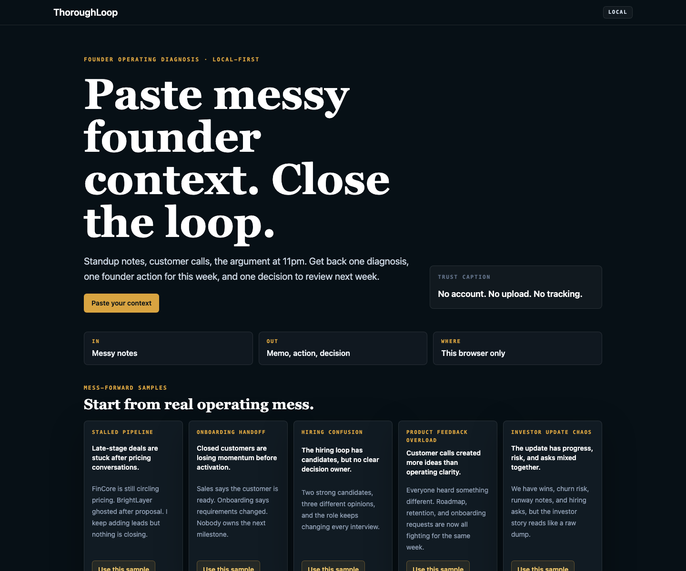
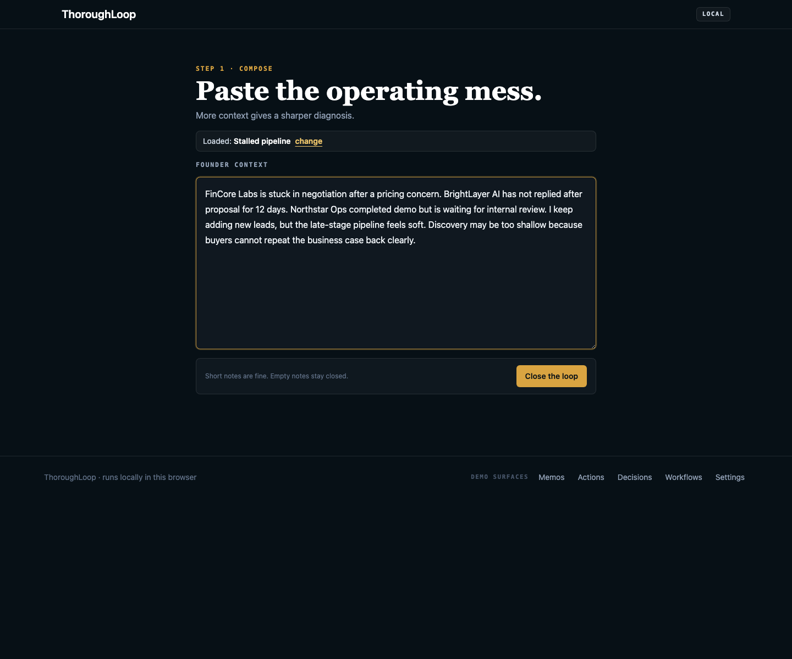
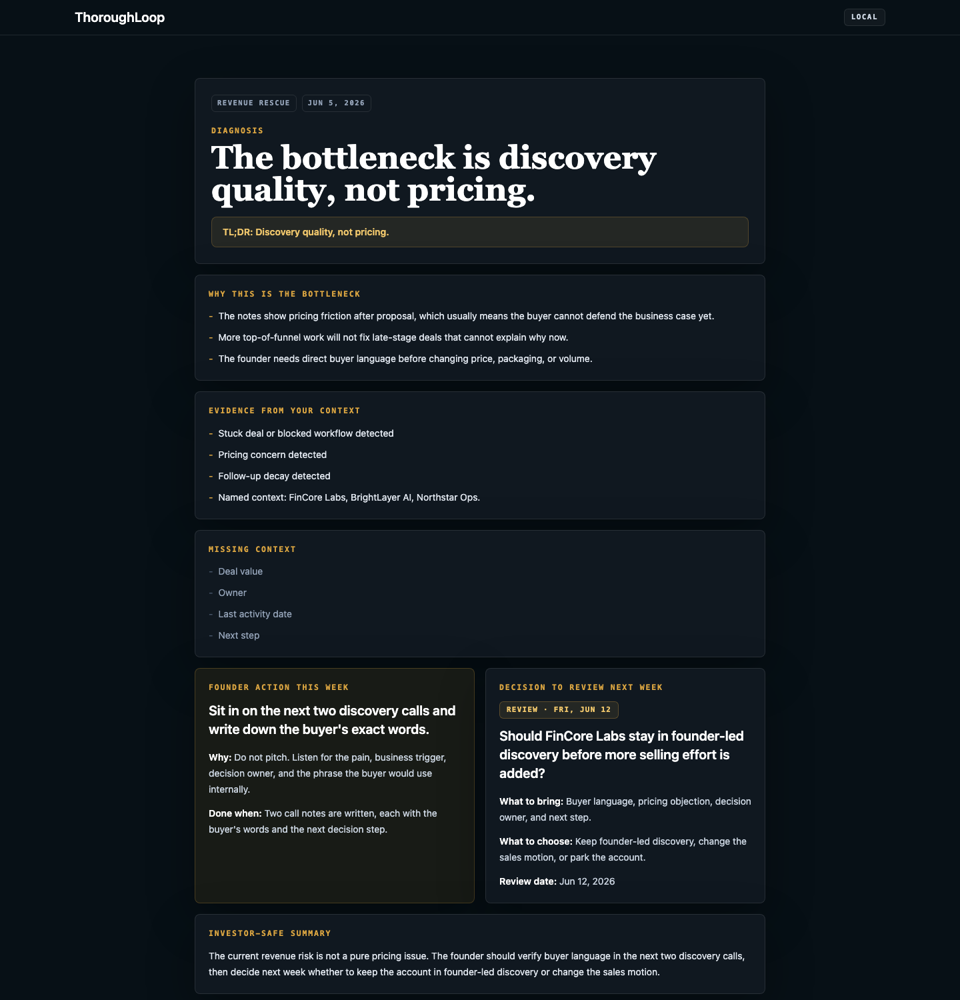
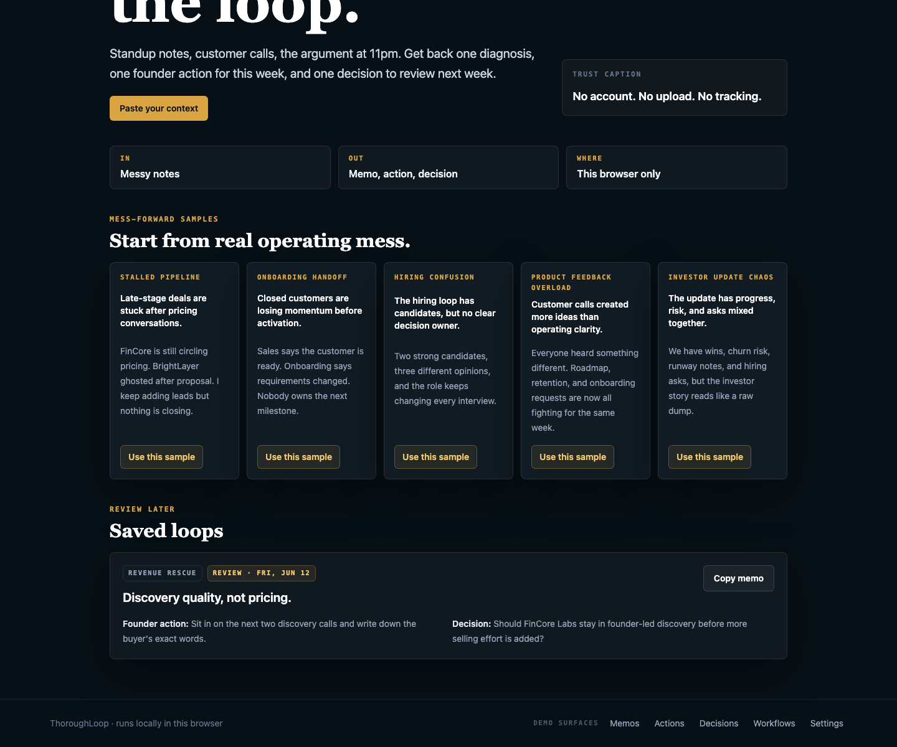

# ThoroughLoop

[](https://github.com/shubham1502-hue/thoroughloop/actions/workflows/ci.yml)

ThoroughLoop is a local-first founder operating diagnosis tool that turns messy founder context into one diagnosis, one founder action, and one decision to review next week.

Paste messy founder context. Close the loop.

## Live Demo

https://thoroughloop.vercel.app

## Why This Exists

Early-stage founder context is scattered across standup notes, customer calls, Slack threads, CRM updates, investor drafts, and follow-ups. The problem is not another dashboard. The problem is converting messy context into a clear operating loop.

ThoroughLoop keeps the loop narrow: paste the mess, identify the bottleneck, choose one founder action, and save one decision to review later.

## Core Loop

1. Paste messy founder context.
2. Get one diagnosis.
3. Pick one founder action.
4. Save one decision to review next week.
5. Return later through saved loops.

## Screenshots

Captured from the current app with sample founder context.









## Demo Walkthrough

1. Open the [live demo](https://thoroughloop.vercel.app).
2. Click `Paste your context`.
3. Try a sample or paste short messy founder notes.
4. Click `Close the loop`.
5. Review the diagnosis, TL;DR, evidence, missing context, founder action, decision, review date, and investor-safe summary.
6. Click `Save loop`.
7. Return to the landing page and confirm the saved loop appears.
8. Use the footer `Demo surfaces` links to inspect `Memos`, `Actions`, `Decisions`, `Workflows`, and `Settings`.

For a slightly longer manual path, see [docs/demo-walkthrough.md](docs/demo-walkthrough.md).

## What Reviewers Can Inspect

- The main loop on `/`.
- Saved memos on `/memos`.
- Founder actions on `/action-queue`.
- Decisions to review on `/decision-log`.
- Workflow-specific loops on `/workflows`.
- Local founder context defaults on `/settings`.
- Public-safe intake and webhook examples in [docs/demo/api-and-webhook-demo.md](docs/demo/api-and-webhook-demo.md).
- A lightweight Notion API export workflow that converts generated founder memos, actions, and review decisions into structured database records with validation, tests, and setup notes in [docs/notion-export.md](docs/notion-export.md).

## Local-First Boundary

ThoroughLoop stores saved loops, memos, actions, decisions, and settings in this browser through `localStorage`. There is no account, cross-device sync, or server-side persistence in the web MVP.

Clearing browser storage may remove saved local data. The API and webhook docs use synthetic or generic payloads and do not add provider OAuth, live external sync, request persistence, auth, database storage, or server-side AI.

## Intentionally Out Of Scope

This is product discipline, not missing setup:

- No backend.
- No auth.
- No database.
- No payments.
- No team workspace.
- No CRM UI.
- No analytics.
- No AI provider integration.
- No external data sync.
- No production sync across devices.

## Tech Stack

- Next.js 16 web app in `apps/web`.
- React 18 and TypeScript.
- Tailwind CSS styling.
- Deterministic product logic in `packages/core`.
- Shared design tokens in `packages/ui`.
- Browser `localStorage` persistence through storage adapters.
- Playwright e2e coverage for the browser loop.
- Node test runner through `tsx --test` for core logic.
- Expo mobile skeleton in `apps/mobile` for later reuse of shared core logic.
- Vercel deployment for the public web demo.

## Repo Structure

```text
apps/
  web/       Next.js web MVP
  mobile/    Expo skeleton
packages/
  core/      Product logic, types, storage helpers, workflow detection, memo generation
  ui/        Shared design tokens
docs/        Product, API, webhook, deployment, and handoff documentation
```

## Run Locally

Use Node 20.19 or newer.

```bash
npm ci
npm run dev:web
```

Then open `http://localhost:3000`.

## Validation

Use the repo scripts before opening a PR:

```bash
npm run lint
npm run typecheck
npm run test
npm run build
git diff --check
npm run test:e2e
```

`npm run test` runs the core test suite. `npm run test:e2e` runs the Playwright smoke test for the main browser loop.

Manual browser validation is documented in [docs/manual-smoke-test.md](docs/manual-smoke-test.md).

## Public-Safe Boundary

This repository uses synthetic examples and local-first persistence. It does not claim production usage, customers, revenue impact, compliance readiness, or live external data integrations.

For the local data boundary, see [docs/privacy-local-data.md](docs/privacy-local-data.md).

## GitHub Project Description

A local-first founder operating diagnosis tool that turns messy founder context into one diagnosis, one action, and one decision to review next week.
